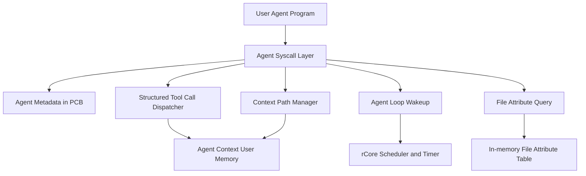
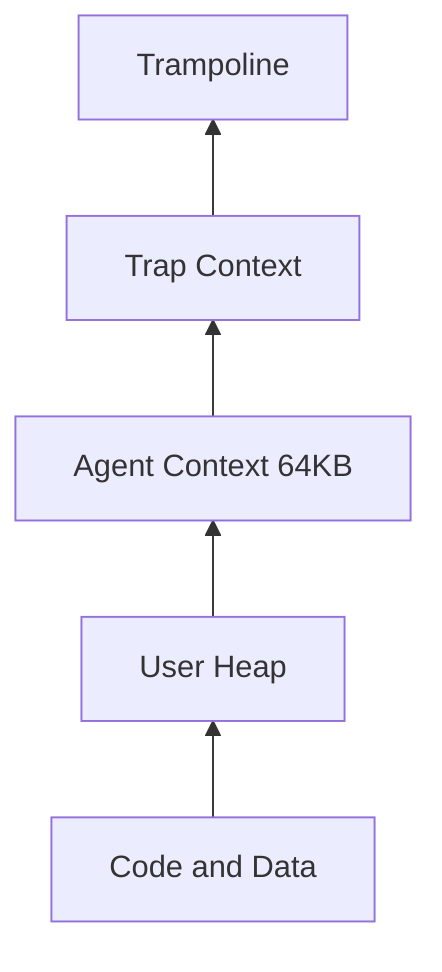
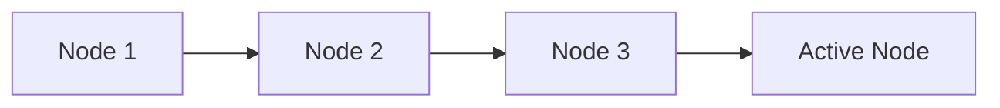
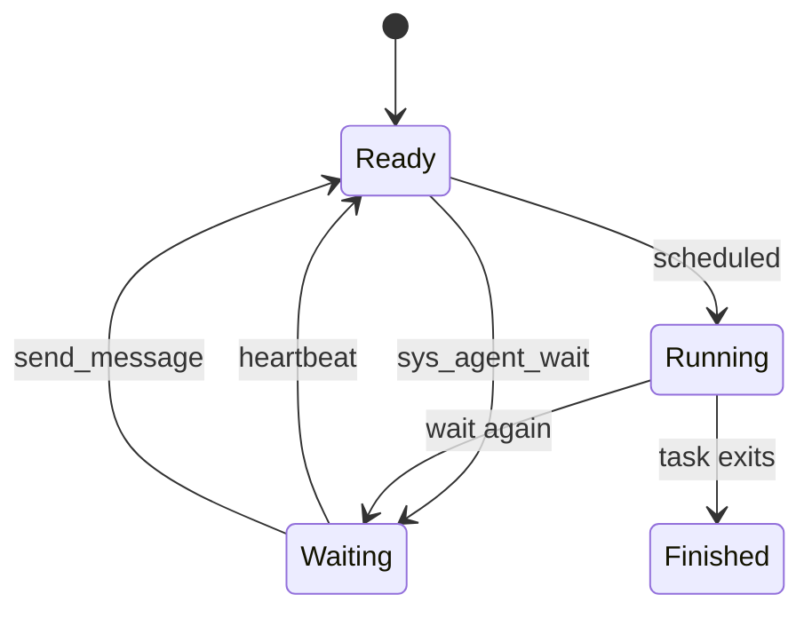

# Agent-OS Overall Design

## Scope

Agent-OS extends rCore-Tutorial v3 with kernel mechanisms for AI-agent style programs. The kernel does not run a real LLM. Instead, user-space demo agents use deterministic policies to exercise the same OS-facing loop shape: think, call a structured tool, observe the result, record context, and wait for the next trigger.

## Architecture



The implementation keeps mechanism and policy separate:

- Kernel state: Agent identity, quotas, loop state, heartbeat deadlines, wake reasons, and Context Path metadata.
- User state: high-frequency Context Path bytes, tool result buffers, and policy summaries inside Agent Context.

## Agent Process Model

Each task has optional Agent metadata in its task control block. `None` means a normal process. `Some(AgentMeta)` means an Agent process with:

- `agent_type`
- `heartbeat_interval`
- `heartbeat_next_at`
- `resource_quota`
- `loop_state`
- `pending_wake_reason`
- `pending_messages`
- `agent_context_base`
- `agent_context_size`
- Context Path counters and recent node metadata

`sys_agent_create(agent_type, heartbeat_interval, resource_quota)` marks the current process as an Agent and maps its Agent Context. `fork()` children do not implicitly inherit Agent identity; if the parent is an Agent, the child also removes the copied Agent Context mapping so metadata and address space remain consistent.

## Address Space Layout

Agent Context is a fixed 64KB user-space region:



The mapping is readable, writable, and user accessible. The kernel records base and size in `AgentMeta`, while user-space can directly read and write high-frequency context data without a syscall.

## Tool Call Protocol

Agent tool calls use a fixed binary ABI rather than JSON:

```text
ToolRequest {
  tool_id,
  param_count,
  params[4] = ToolParam { key_id, value_type, value }
}

ToolResponse {
  status,
  result_len,
  result_offset
}
```

The response payload is written into Agent Context. `result_offset` points to the structured result, so user-space can decode it directly.

Implemented tools:

- `get_system_status`
- `query_process`
- `send_message`
- `query_file`

Representative error codes:

- `-3`: current process is not an Agent.
- `-4`: unknown tool id.
- `-5`: invalid parameter count or type.
- `-6`: Agent Context quota exceeded.
- `-7`: target object not found or not valid for the operation.

## Context Path

Context Path records each Agent Loop step as a node:

```text
ContextNode {
  node_id,
  prev_id,
  timestamp,
  tool_id,
  request_offset,
  request_len,
  result_offset,
  result_len,
  node_offset,
  flags
}
```

Node bytes live in Agent Context. The PCB keeps bounded metadata for recent nodes, active node id, write offset, next node id, and quota state.



Supported operations:

- `sys_context_push`
- `sys_context_query`
- `sys_context_rollback`
- `sys_context_clear`

When there is not enough remaining quota for a new node, the implementation resets the write offset and clears old live node metadata. This simplified FIFO strategy prevents unbounded memory growth while keeping the demo predictable.

## Agent Loop

Agent Loop wakeups are kernel-managed:



`sys_agent_wait()` blocks the current Agent instead of re-adding it to the ready queue. Timer interrupts scan Agent heartbeat deadlines and wake blocked Agents when needed. `send_message` records a pending message and wakes the target Agent.

Wake reasons are returned as a bitset:

- `AGENT_WAKE_HEARTBEAT = 1`
- `AGENT_WAKE_MESSAGE = 2`

## File Attribute Query

Agent-OS adds an in-memory file attribute table with fixed capacity. Each entry stores:

- path
- type
- owner
- tag
- priority

`sys_file_attr_set` and `sys_file_attr_delete` manage attributes. `query_file` supports AND queries over the fields above and returns structured summaries in Agent Context.

The query result also reports two visit counts:

- `traversal_visits`: entries visited by full-table traversal.
- `indexed_visits`: candidate entries visited using the first query condition as a simplified index key.

This gives the integrated demo a concrete performance comparison without changing the easy-fs on-disk inode format.

## Integrated Demo

The final `agent_demo full` scenario combines:

- Agent creation and Agent Context.
- Structured tool calls.
- Context Path recording.
- Heartbeat wakeup.
- Message wakeup between Admin-Agent and Worker-Agent.
- File attribute query and access-count comparison.

Because current rCore userspace does not pass argv to programs, `user_shell` maps:

```text
agent_demo basic          -> agent_demo_basic
agent_demo loop           -> agent_demo_loop
agent_demo fs_query_bench -> agent_demo_fs_query_bench
agent_demo full           -> agent_demo_full
```
