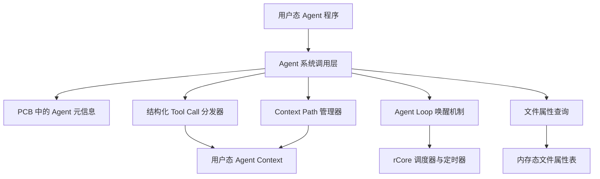
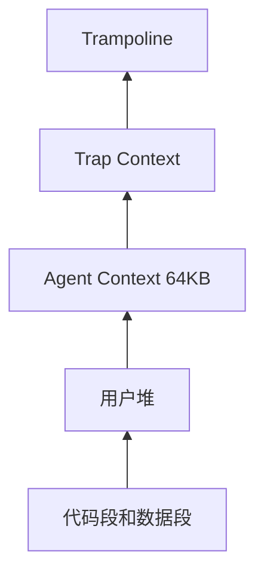
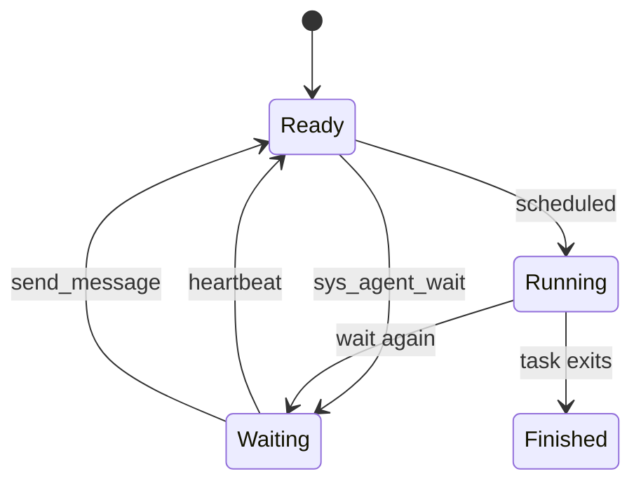

# Agent-OS 总体设计

## 范围

Agent-OS 在 rCore-Tutorial v3 上扩展面向 AI Agent 程序的内核机制。内核不运行真实 LLM；用户态 demo Agent 使用确定性策略模拟同样的 OS 交互模式：思考、发起结构化工具调用、观察结果、记录上下文，并等待下一次触发。

## 总体架构



实现遵循机制与策略分离：

- 内核态保存 Agent 身份、配额、Loop 状态、心跳 deadline、唤醒原因和 Context Path 元信息。
- 用户态保存高频访问的 Context Path 字节、工具结果缓存和策略摘要，存放在 Agent Context 区中。

## Agent 进程模型

每个任务控制块中都有可选的 Agent 元信息。`None` 表示普通进程；`Some(AgentMeta)` 表示 Agent 进程，包含：

- `agent_type`
- `heartbeat_interval`
- `heartbeat_next_at`
- `resource_quota`
- `loop_state`
- `pending_wake_reason`
- `pending_messages`
- `agent_context_base`
- `agent_context_size`
- Context Path 计数器和近期节点元数据

`sys_agent_create(agent_type, heartbeat_interval, resource_quota)` 将当前进程登记为 Agent，并映射 Agent Context。`fork()` 子进程不会隐式继承 Agent 身份；如果父进程是 Agent，子进程还会移除复制来的 Agent Context 映射，保证 PCB 元信息和地址空间语义一致。

## 地址空间布局

Agent Context 是固定的 64KB 用户态地址区间：



该区域具备用户态读写权限。内核只在 `AgentMeta` 中记录 base 和 size，用户态可以直接读写高频上下文数据，不需要每次都通过系统调用。

## Tool Call 协议

Agent 工具调用使用固定二进制 ABI，而不是 JSON：

```text
ToolRequest {
  tool_id,
  param_count,
  params[4] = ToolParam { key_id, value_type, value }
}

ToolResponse {
  status,
  result_len,
  result_offset
}
```

响应负载写入 Agent Context。`result_offset` 指向结构化结果，用户态可以直接按结构体解码。

已实现工具：

- `get_system_status`
- `query_process`
- `send_message`
- `query_file`

代表性错误码：

- `-3`：当前进程不是 Agent。
- `-4`：未知 tool id。
- `-5`：参数数量或参数类型错误。
- `-6`：Agent Context 配额不足。
- `-7`：目标对象不存在，或目标不满足操作要求。

## Context Path

Context Path 将 Agent Loop 的每一步记录为节点：

```text
ContextNode {
  node_id,
  prev_id,
  timestamp,
  tool_id,
  request_offset,
  request_len,
  result_offset,
  result_len,
  node_offset,
  flags
}
```

节点正文存放在 Agent Context 中。PCB 只保存有界的近期节点元数据、active 节点 id、写入 offset、下一个节点 id 和配额状态。


支持的操作：

- `sys_context_push`
- `sys_context_query`
- `sys_context_rollback`
- `sys_context_clear`

当剩余配额不足以写入新节点时，当前实现会重置写入 offset，并清空旧 live 节点元数据。这是简化版 FIFO 策略，可以防止 Context 无限增长，同时保持 demo 行为稳定。

## Agent Loop

Agent Loop 的唤醒由内核管理：



`sys_agent_wait()` 会阻塞当前 Agent，而不是继续放回 ready queue。定时器中断扫描 Agent 心跳 deadline；到期后唤醒阻塞中的 Agent。`send_message` 会记录待处理消息并唤醒目标 Agent。

唤醒原因以 bitset 返回：

- `AGENT_WAKE_HEARTBEAT = 1`
- `AGENT_WAKE_MESSAGE = 2`

## 文件属性查询

Agent-OS 增加了一张固定容量的内存态文件属性表。每个条目保存：

- path
- type
- owner
- tag
- priority

`sys_file_attr_set` 和 `sys_file_attr_delete` 管理属性。`query_file` 支持对这些字段进行 AND 查询，并把结构化摘要结果写入 Agent Context。

查询结果还会报告两类访问次数：

- `traversal_visits`：全量遍历属性表时访问的条目数。
- `indexed_visits`：使用第一个查询条件作为简化索引键后访问的候选条目数。

这样可以在不修改 easy-fs 磁盘 inode 格式的前提下，为综合 demo 提供清晰的性能对比数据。

## 综合演示

最终 `agent_demo full` 场景整合：

- Agent 创建和 Agent Context。
- 结构化工具调用。
- Context Path 记录。
- 心跳唤醒。
- Admin-Agent 与 Worker-Agent 之间的消息唤醒。
- 文件属性查询和访问次数对比。

由于当前 rCore 用户态程序不支持 argv，`user_shell` 将计划中的命令映射为具体二进制：

```text
agent_demo basic          -> agent_demo_basic
agent_demo loop           -> agent_demo_loop
agent_demo fs_query_bench -> agent_demo_fs_query_bench
agent_demo full           -> agent_demo_full
```
